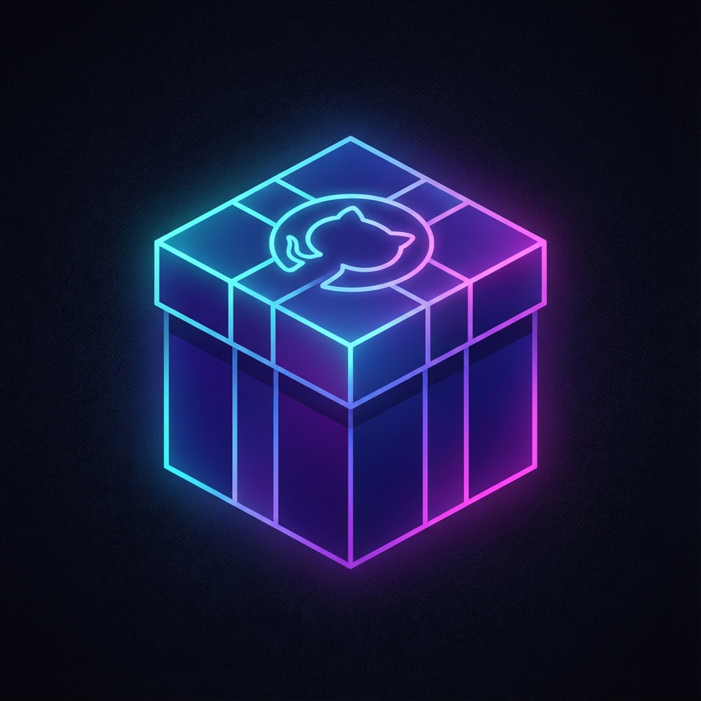
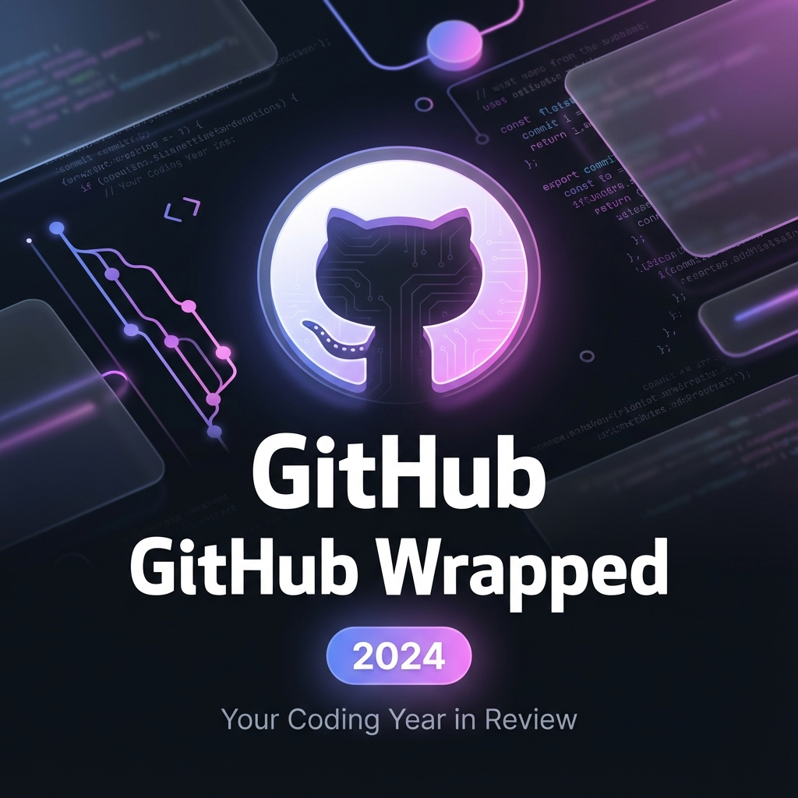

#  GitHub Wrapped



> **Beautiful yearly summary of your coding journey** - Like Spotify Wrapped, but for your GitHub activity!


## ✨ Features

- 🎨 **Stunning Visual Design** - Vibrant gradients, smooth animations, and glassmorphism effects
- 🤖 **AI-Powered Insights** - Personalized analysis of your coding journey using Google Gemini
- 📊 **Comprehensive Stats** - Commits, languages, repos, productivity patterns, and more
- 📱 **Fully Responsive** - Beautiful on desktop, tablet, and mobile
- 🎯 **Year Selection** - View any year's wrapped (2020-2024)
- 🔒 **Privacy-Focused** - All processing happens client-side, credentials never stored
- 🚀 **100% Free** - Uses free GitHub API and Gemini API

## 🎬 What You'll See

1. **Welcome Slide** - Your profile with key stats
2. **Contributions** - Total commits with monthly heatmap
3. **Languages** - Your top programming languages
4. **Productivity** - When you code most (day & time)
5. **Biggest Project** - Your most impactful repository
6. **AI Insights** - Personalized achievements and patterns
7. **Year Summary** - Complete overview with AI-generated summary
8. **Share** - Download and share on social media

## 🚀 Getting Started

### Prerequisites

For your own data, you'll need:
1. **GitHub Personal Access Token** - [Create one here](https://github.com/settings/tokens/new?scopes=read:user,repo&description=GitHub%20Wrapped)
   - Required scopes: `read:user`, `repo`
2. **Gemini API Key** - [Get free key here](https://aistudio.google.com/app/apikey)
   - Free tier available with generous limits

### Running Locally

1. Clone or download this repository
2. Open `index.html` in your web browser
3. Enter your credentials:
   - GitHub username
   - GitHub Personal Access Token
   - Gemini API Key
   - Select year (2020-2024)
4. Click "Generate My Wrapped" ✨

**That's it!** No installation, no build process, no dependencies.

## 🌐 Live Demo

**Try it now!** Visit the live version at:  
👉 **[https://01developer95.github.io/GitHub-Wrapped/](https://01developer95.github.io/GitHub-Wrapped/)**

Create your own GitHub Wrapped and share your coding journey with the world!

### Deployment

This repository includes a `dist/` folder containing the production-ready build.

**If you want to host this on GitHub Pages:**
- You only need to upload the contents of the `dist` folder.
- The `dist` folder contains:
  - `index.html` (Main entry point)
  - `app.js` (Bundled JavaScript)
  - `styles.css` (Styles)
  - `favicon.png` (Icon)

Use the contents of `dist` for the cleanest deployment.

## 📁 Project Structure

```
github-wrapped/
└── dist/              # 🚀 Production Build (Ready for upload)
    ├── index.html     
    ├── app.js         
    ├── styles.css     
    └── favicon.png    
```

## 🎨 Design Philosophy

- **Premium First** - State-of-the-art design that wows users
- **Smooth Animations** - Micro-interactions for enhanced UX
- **Dark Mode** - Easy on the eyes, looks professional
- **Vibrant Colors** - Curated gradients (purple, pink, blue, green)
- **Glassmorphism** - Modern frosted glass effects
- **Responsive** - Mobile-first, works everywhere

## 🔧 Technical Details

### Technologies Used
- **Pure HTML/CSS/JavaScript** - No frameworks needed
- **GitHub REST API v3** - For fetching user data
- **Google Gemini API** - For AI-powered insights
- **CSS Custom Properties** - For theming
- **CSS Grid & Flexbox** - For layouts
- **Google Fonts (Inter)** - For typography

### Browser Support
- Chrome/Edge (recommended)
- Firefox
- Safari
- Any modern browser with ES6+ support

## 🔐 Privacy & Security

- ✅ All data processing happens **client-side**
- ✅ Your tokens are **never stored** or sent to any server
- ✅ Only communicates with GitHub API and Gemini API
- ✅ No backend, no database, no tracking
- ✅ Open source - verify the code yourself

## 📊 API Rate Limits

### GitHub API
- **Authenticated**: 5,000 requests/hour
- This app uses ~10-50 requests depending on your repo count
- More than enough for generating your wrapped

### Gemini API
- **Free tier**: 60 requests/minute
- This app uses 2-3 requests per wrapped
- Very generous limits

## 🎯 Customization

Want to customize the design? All styles are in `styles.css`:

```css
:root {
    /* Change colors */
    --accent-purple: #667eea;
    --accent-pink: #f093fb;
    
    /* Change gradients */
    --gradient-primary: linear-gradient(135deg, #667eea 0%, #764ba2 100%);
    
    /* Adjust spacing */
    --spacing-lg: 2rem;
}
```

## 🐛 Troubleshooting

### "Invalid GitHub token"
- Make sure you created a token with `read:user` and `repo` scopes
- Check that you copied the entire token (starts with `ghp_`)

### "Invalid Gemini API key"
- Verify you copied the complete key from Google AI Studio
- Make sure the API key is active

### "Rate limit exceeded"
- Wait for the reset time shown in the error
- GitHub rate limits reset hourly

### Charts not showing
- Make sure you're viewing the correct slide
- Try refreshing the page
- Check browser console for errors

## 🤝 Contributing

This is a simple, standalone project. Feel free to:
- Fork and customize for your needs
- Report bugs or suggest features
- Share your wrapped on social media!

## 📄 License

MIT License

Copyright (c) 2024-2025 01Developer95

Permission is hereby granted, free of charge, to any person obtaining a copy
of this software and associated documentation files (the "Software"), to deal
in the Software without restriction, including without limitation the rights
to use, copy, modify, merge, publish, distribute, sublicense, and/or sell
copies of the Software, and to permit persons to whom the Software is
furnished to do so, subject to the following conditions:

The above copyright notice and this permission notice shall be included in all
copies or substantial portions of the Software.

THE SOFTWARE IS PROVIDED "AS IS", WITHOUT WARRANTY OF ANY KIND, EXPRESS OR
IMPLIED, INCLUDING BUT NOT LIMITED TO THE WARRANTIES OF MERCHANTABILITY,
FITNESS FOR A PARTICULAR PURPOSE AND NONINFRINGEMENT. IN NO EVENT SHALL THE
AUTHORS OR COPYRIGHT HOLDERS BE LIABLE FOR ANY CLAIM, DAMAGES OR OTHER
LIABILITY, WHETHER IN AN ACTION OF CONTRACT, TORT OR OTHERWISE, ARISING FROM,
OUT OF OR IN CONNECTION WITH THE SOFTWARE OR THE USE OR OTHER DEALINGS IN THE
SOFTWARE.

## 🙏 Credits

- Inspired by **Spotify Wrapped**
- Powered by **GitHub API** and **Google Gemini**
- Built with ❤️ for the developer community

## 📱 Share Your Wrapped!

Created your GitHub Wrapped? Share it with:
- **Twitter**: Use #GitHubWrapped
- **LinkedIn**: Show your professional growth
- **Dev.to**: Inspire other developers

---

**Made with 💜 by developers, for developers**

Enjoy your GitHub Wrapped! 🎉

---

<div align="center">

**© 2024-2025 01Developer95. All rights reserved.**

[GitHub](https://github.com/01Developer95/GitHub-Wrapped) • [Report Bug](https://github.com/01Developer95/GitHub-Wrapped/issues) • [Request Feature](https://github.com/01Developer95/GitHub-Wrapped/issues)

</div>
